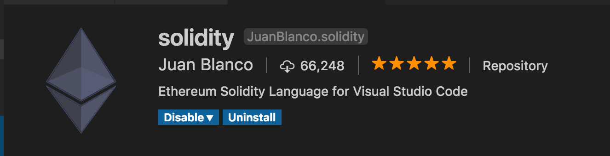
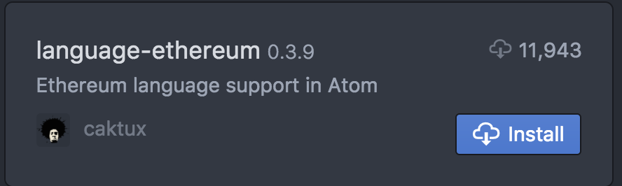

# BLOCKCHAIN 101

This repo contains all the content for the blockchain primer workshop. 

For tutorial instructions:

* Hello Blockchain [tutorial](HelloBlockchain.md)
* Bed and Blockchain booking dapp [tutorial](http://github.com/thetrendytechie/bed-and-blockchain-start)

For the Dapp Primer slides: [PDF](DappPrimerDeck.pdf)

# Environment Setup

## Mac OS

**1. Homebrew**

[Homebrew](http://brew.sh) is a package manager for Mac OS. We will use it to install the packages necessary to work with Ethereum.

To get Homebrew, run the following command in your terminal:

	/usr/bin/ruby -e "$(curl -fsSL https://raw.githubusercontent.com/Homebrew/install/master/install)"

**2. Node**

Next, we'll need [Node.js](http://nodejs.org). To install it anew, run the following command:

	brew install node
	
If you already have node installed, ensure that you are running version 8.9.4 or later. To check your current version, run:

	node -v

**3. Text Editor**

You may use your text editor of choice, but we recommend Atom or Visual Studio Code. Using one of these, download and install the Solidity language package - you will need it for your smart contracts.

- Get Visual Studio Code [here](https://code.visualstudio.com/)
- Get Atom [here](http://atom.io) 

If you are using Visual Studio, use the package manager to install the solidity package by Juan Blanco:

If you are using Atom, use the installer to install language-ethereum:

Once you have installed the language, be sure to restart the text editor before beginning your project so the changes take effect.

**4. Ganache CLI (Formerly TestRPC)**

Ganache is an Ethereum node implemented in JS that acts as an emulator for blockchain test networks, allowing you to test your smart contracts locally instead of on the real net. To install it, run the following in your terminal:

	brew install ganache-cli
	
To confirm that Ganache installed successfully, run the following command:

	ganache-cli
	
This will start up a new node.

**5. Truffle**

Truffle is a smart contract framework we will use to build and deploy our contracts. To install it, run the following command:

	npm install -g truffle

## Windows

**1. Node.js**

We will be using [Node.js](http://nodejs.org) along with our Ethereum tools. to install it anew, run the following command in your Command Prompt:

	npm install -g node
	
If you have a previous version of Node installed, you'll want to be sure you're working with 8.9.4 or later. To check the version you currently have installed:
	
	node -v

**2. Text Editor**

You may use your text editor of choice, but we recommend Atom or Visual Studio Code. Using one of these, download and install the Solidity language package - you will need it for your smart contracts.

- Get Visual Studio Code [here](https://code.visualstudio.com/)
- Get Atom [here](http://atom.io) 

If you are using Visual Studio, use the package manager to install the solidity package by Juan Blanco:

If you are using Atom, use the installer to install language-ethereum:

Once you have installed the language, be sure to restart the text editor before beginning your project so the changes take effect.

**3. Ganache CLI (Formerly TestRPC)**

Ganache is an Ethereum node implemented in JS that acts as an emulator for blockchain test networks, allowing you to test your smart contracts locally instead of on the real net. To install it, run the following:

	npm install -g ganache-cli
	
To confirm that Ganache installed successfully, run the following command:

	ganache-cli
	
This will start up a new node.

**4. Truffle**

Truffle is a smart contract framework we will use to build and deploy our contracts. To install, run the following npm command:

	npm install -g truffle

Confirm that installation was successful by checking the version:
	
	truffle --version
	

## Linux

**1. Node.JS**

Install curl

	sudo apt install curl

Download Node.JS using the commands for your distribution, found [here](https://nodejs.org/en/download/package-manager/).

Ensure you are using a recent stable version of Node. To check your current version of Node and NPM, run the following commands:

	node -v
	npm -v

**2. Ganache CLI**

Ganache is an Ethereum node implemented in JS that acts as an emulator for blockchain test networks, allowing you to test your smart contracts locally instead of on the real net. To install it, run the following:

	sudo npm install -g ganache-cli

**3. Truffle**

Truffle is a smart contract framework we will use to build and deploy our contracts. To install it, run the following command:

	sudo npm install -g truffle
	
**4. Text Editor**

You may use your text editor of choice, but we recommend Atom or Visual Studio Code. Using one of these, download and install the Solidity language package - you will need it for your smart contracts.

- Get Visual Studio Code [here](https://code.visualstudio.com/)
- Get Atom [here](http://atom.io) 

If you are using Visual Studio, use the package manager to install the solidity package by Juan Blanco:

If you are using Atom, use the installer to install language-ethereum:

Once you have installed the language, be sure to restart the text editor before beginning your project so the changes take effect.
